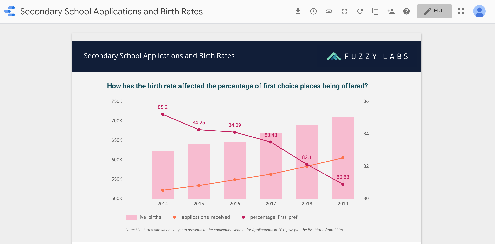

# forgood-school-admissions

Loading [open datasets](https://data.gov.uk/) into [Google BigQuery](https://cloud.google.com/bigquery/) using [Terraform](https://www.terraform.io/).

BigQuery is Google's serverless, scalable data warehouse that enables training custom Machine Learning models using SQL.

Terraform (by Hashicorp) is the definitive tool for provisioning Cloud resources. It enables 'everything' to be defined as code.

## Hypothesis

In England, an increased number of children are not getting a place at their first choice high school due to a baby boom towards the end of the 2000s. We will test this theory by comparing live birth data with school application data. Note, in the UK, children starting high school in the September after they turn 11. Therefore we will compare school admission data with live births from 11 years previous.

## Data Sources
https://www.gov.uk/government/statistics/secondary-and-primary-school-application-and-offers-2019
https://www.ons.gov.uk/peoplepopulationandcommunity/birthsdeathsandmarriages/livebirths/datasets/birthsummarytables

## Method

* Get the data
* Create BigQuery dataset and tables
* Load the data into BigQuery
* Run some queries on the data
* Create some nice visualisations using [Google Data Studio](https://www.blog.google/products/marketingplatform/analytics/data-studio-now-generally-available/)

### Get the data
`curl -O https://assets.publishing.service.gov.uk/government/uploads/system/uploads/attachment_data/file/807801/2019_Apps_Offers_UD_time_series.csv`

Download (in browser) https://www.ons.gov.uk/generator?uri=/peoplepopulationandcommunity/birthsdeathsandmarriages/livebirths/bulletins/birthsummarytablesenglandandwales/2017/a819f426&format=csv and rename as `2017_Live_Births.csv`

### Clean the data

#### Applications and Offers

Some of the integer fields contain a 'x' rather than a blank.
`sed -i '' 's/,x/,/g' 2019_Apps_Offers_UD_time_series.csv`

#### Live Births

Remove the first 10 lines of non csv data
`sed -i '' '1,9d' 2017_Live_Births.csv`

Remove Total Fertility Rate (3rd column)
`cat 2017_Live_Births.csv | awk -F, '{print $1 "," $2}' > temp && mv temp 2017_Live_Births.csv`

Remove the decimal point (convert to thousands)
`sed -i '' 's/\.//g' 2017_Live_Births.csv`

Add a heading
`sed -i '' '1s/^/"year","live_births"\n/' 2017_Live_Births.csv`

### Load the data into BigQuery

First of all we need to create the BigQuery [dataset](https://cloud.google.com/bigquery/docs/datasets) and [tables](https://cloud.google.com/bigquery/docs/tables) with an appropriate schema. Once they are created we will [load the data](https://cloud.google.com/bigquery/docs/loading-data-local) into the tables from our local CSV files.

We'll do all this using [Terraform](https://www.terraform.io/) which is the definitive tool for defining Cloud resources as code.

Install Terraform [here](https://www.terraform.io/downloads.html), then run:
```
cd terraform
terraform init
terraform plan
terraform apply
```

### Query the Data

* Open up BigQuery and run the SQL in [data/national_secondary_admissions_and_live_births.sql](data/national_secondary_admissions_and_live_births.sql)
* Save the results of the query as a [view](https://cloud.google.com/bigquery/docs/views-intro)

### Create a visualisation in Data Studio

Using the view as a Data Source, create a report like this one!


